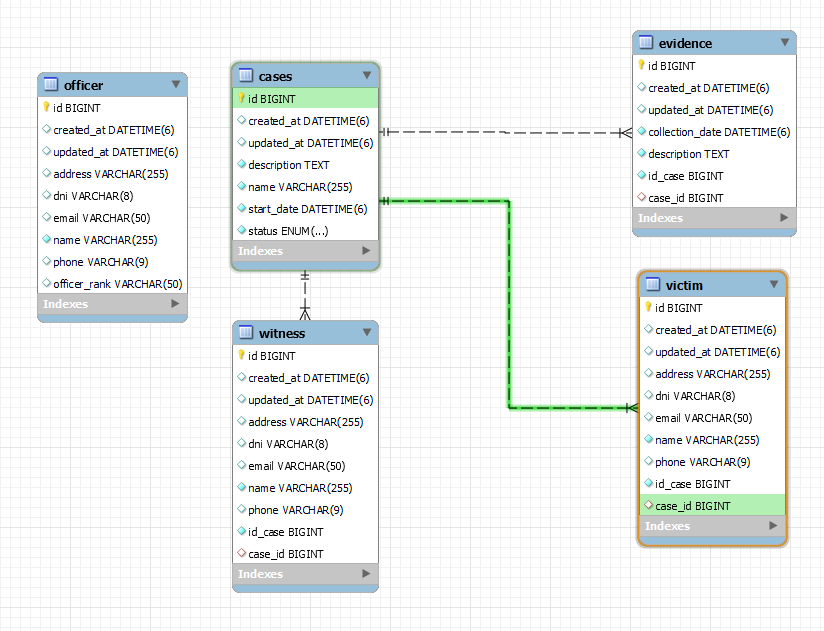

<h1 align="center">Bienvenido al Dashboard Commissar 👋</h1>
<p>
  
</p>

> Proyecto backend realizado, para la creacion de casos relacionados, con evidencia, victimas y testigos



## Uso

```sh
mvn spring-boot:run
```

## Autor

👤 **Marcos Alanya Pacheco**

* Website: https://marcos-alanya-portafolio.vercel.app/
* Github: [@MarcosAlanya19](https://github.com/MarcosAlanya19)
* LinkedIn: [@marcosalanya19](https://linkedin.com/in/marcosalanya19)
